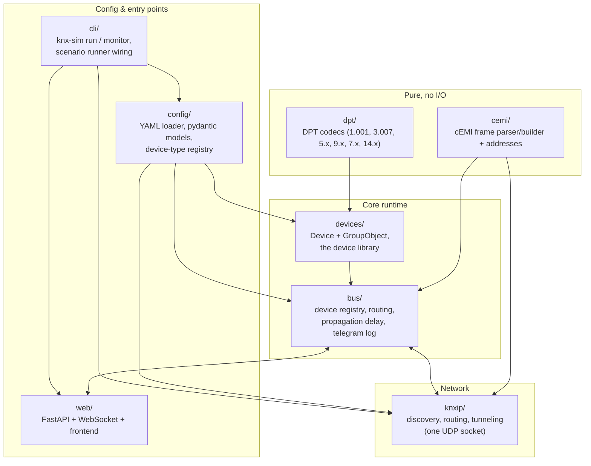
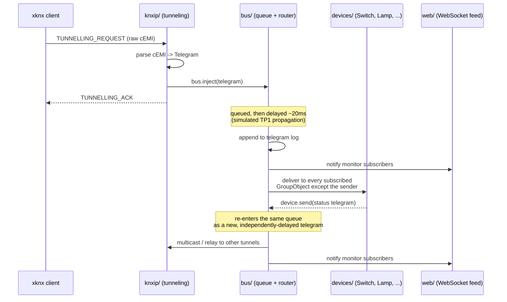

# Architecture

`knx-sim` is a single process, single asyncio event loop, no external
services. This doc is the "how the pieces fit together" companion to
`docs/SPEC.md` (what/why) and `docs/notes/` (byte-level protocol
detail) — read those for the parts this doc only summarizes.

## Module map

`dpt/` and `cemi/` are pure functions with no asyncio and no I/O —
encode/decode and parse/serialize only. Everything above them is where
state and time enter the picture.

## Data flow: a telegram's journey

The same `Bus` is the single source of truth no matter which door a
telegram comes in or goes out — a tunneling client, a multicast router
peer, the web dashboard's manual injector, and a scenario script are all
just callers of `bus.inject()`.

The "device reacts, sends its own telegram, which re-enters the queue"
step is what makes multi-hop behavior (switch write → lamp reacts →
status telegram appears on the bus and over the wire) fall out
naturally from the bus's own queue, with no special-casing anywhere —
see `knx_sim/bus/router.py`'s module docstring.

## Bus internals (`bus/`)

`Bus` models a single shared serial medium, the same way real TP1 is
one shared pair of wires: exactly one telegram is "on the wire" at a
time. Concretely:

- an `asyncio.PriorityQueue` orders by KNX priority (System > Urgent >
  Normal > Low) then FIFO within a priority tier
- each dequeued telegram sleeps a fixed delay (default 20ms, modeling
  TP1 at 9600 bit/s) before being routed — this is `Bus._process()`,
  and it's the only place simulated time enters telegram delivery
- routing looks up `telegram.destination` in a `GroupAddress ->
  [(Device, GroupObject)]` index built at registration time, skips the
  sender itself, and gates delivery on the group object's
  Communication flag (and Write/Update/Read depending on service —
  F-BUS-2/3)
- every processed telegram is appended to a bounded `deque` (the
  rolling telegram log, F-BUS-5) and handed to every subscribed monitor
  callback (F-BUS-6) — the web dashboard's WebSocket feed and
  `knx-sim monitor` are both just monitor subscribers, same mechanism
- `bus.inject()` (F-BUS-7) only enqueues; it does not wait for
  delivery. `bus.join()` waits for the queue (and anything a step's
  processing cascades into) to drain — callers that need to observe an
  effect right after injecting (the scenario runner, tests) call
  `join()` explicitly rather than assuming `inject()` was synchronous.

## Device model (`devices/`)

A `Device` is an individually-addressed bag of named `GroupObject`s.
`GroupObject` is pure state — group address, DPT id, the five KNX flags
(Communication/Read/Write/Transmit/Update), and a current value — with
no bus reference of its own; it knows how to turn its Python value into
the `int | bytes` shape a `Telegram` payload expects (and back), nothing
more.

`Device.handle_group_write()`/`handle_group_read()` are the two hooks
the bus calls into; the base class already implements F-DEV-8 ("every
device answers GroupValueRead on a Read-flagged object") so most
concrete devices only need to override `handle_group_write`. Devices
with self-driven, time-based behavior (dimmer ramps, blind travel,
thermostat physics, cyclic transmission) override `start()`/`stop()` to
launch and cancel their own `asyncio.Task` — the bus calls `start()`
right after registration and `stop()` during shutdown; devices with no
such behavior (a plain switch actuator, a wall switch) simply don't
override either.

## KNXnet/IP server (`knxip/`)

One `asyncio.DatagramProtocol` on one UDP socket handles discovery,
routing, *and* tunneling simultaneously — see
`knx_sim/knxip/server.py`'s module docstring for exactly why one socket
suffices (it's bound to the KNXnet/IP port and joined to the discovery
multicast group, so both unicast and multicast traffic land on the same
receive callback).

The tunneling half is the one with real state: `TunnelChannel` (in
`knx_sim/knxip/tunnel_channel.py`) is a deliberately pure state machine
— `CONNECTING -> CONNECTED -> DISCONNECTING`, plus sequence-number
accept/repeat/reject decisions — with no asyncio or socket access of its
own, so it's unit-testable without real timers or sockets. `KnxIpServer`
owns the actual timers (120s heartbeat staleness, 1s ACK retry) and
calls into that pure logic to decide what to do. See
`docs/notes/knxip.md` for the full byte-level frame formats and the
sequence-counter rules.

## Configuration (`config/`)

`load_installation_file()` parses and validates a YAML file into an
`InstallationConfig` (pydantic; pure data, no I/O beyond the read).
`build_simulator()` then wires that config into an actual `Bus` +
`KnxIpServer` + registered `Device` instances via a device-type registry
(`config/registry.py`'s `build_device()`, dispatching on each device's
`type` string). Neither function starts anything — `bus.start()` /
`server.start()` stay the caller's responsibility (the CLI, or a test),
matching how every layer below manages its own async lifecycle
explicitly rather than an implicit "construct = running" contract.

## Web dashboard (`web/`)

`create_app(simulator)` takes an already-built, already-started
`Simulator` and wraps it in a FastAPI app: REST endpoints for device
state and the telegram log, a manual telegram injector endpoint, and a
`/ws` WebSocket that streams every bus telegram live (the same
`bus.subscribe()` monitor mechanism `knx-sim monitor` uses, just fanned
out to possibly many connected browser tabs). The web layer never owns
simulator lifecycle itself — it's just another consumer of a running
bus, exactly like `KnxIpServer` is. The static frontend
(`frontend/`, Vite + React + Tailwind) is served from `frontend/dist` if
present (after `npm run build`) and is otherwise simply absent — the
API works standalone either way.

## CLI and scenarios (`cli/`)

`knx_sim/cli/main.py`'s `build()`/`run()` split lets tests drive the
exact startup path (load config → `build_simulator()` → start bus +
KNXnet/IP server → construct, but don't yet serve, the web app) without
needing `run()`'s infinite "serve until Ctrl+C" loop. `knx-sim monitor`
(`cli/monitor.py`) is a separate, independent WebSocket client — it
doesn't build a simulator at all, just connects to one already running,
the same way a browser tab connecting to `/ws` would.

`knx_sim/scenario.py`'s YAML scenario runner is the one component that
sits *outside* the module map above by design: it only ever calls
public APIs another layer already exposes (`bus.inject()`,
`Device.press()`/`trigger()`-style stimulus methods) — see
`docs/notes/` for why the format looks the way it does. This is also
why a scenario doubles as a regression test with no special test-only
code path: `run_scenario()` against a `Simulator` a test built itself is
exactly what the CLI does against a `Simulator` it built from YAML.
